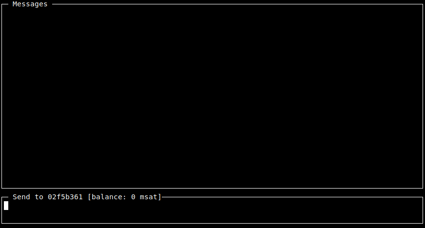

## Lightning Network Daemon - special WHATSAT edition

This repo is a fork of [`lnd`](https://github.com/lightningnetwork/lnd) that demonstrates how the Lightning Network
can be used as an end-to-end encrypted, onion-routed, censorship-resistant, peer-to-peer chat messages protocol.

Recent [changes to the protocol](https://github.com/lightningnetwork/lightning-rfc/pull/619) made it easier then before to attach arbitrary data to a payment. This demo leverages that by attaching a text message and a sender signature.

Ideally users would send each other 0 sat payments and only drop off fees along the way. But that is currently not supported in the protocol. Also, there are minimum htlc amount constraints on channels. As a workaround, in anticipation of a true micropayment network, some money is paid to the recipient of the message. In this demo, it is 1000 msat. Both parties keeping a running balance of what they owe the other and send that back with the next message.

## Usage

* Set up a Lightning Node as usual and open a channel to a well-connected node.

* Run `lncli chat <pubkey>` to start chatting with your chosen destination.

  If running `lncli chat` without a pubkey, a pubkey to send to can be set by typing `/<pubkey>` in the send box.

## Disclaimer

This code only serves to demonstrate the concept and doesn't pass the required quality checks. Use with testnet sats only.